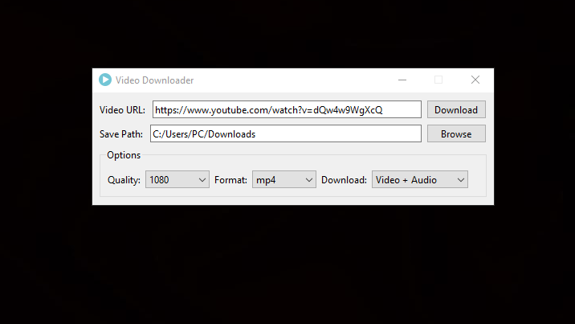
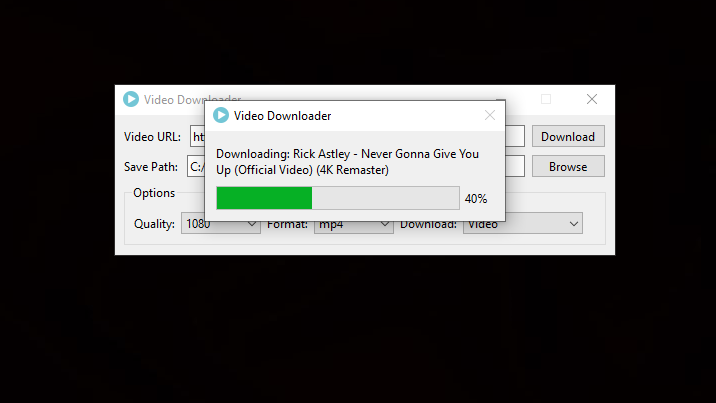

# VideoDownloader

A user-friendly Video Downloader developed using Python, based on [yt-dlp](https://github.com/yt-dlp/yt-dlp)

---

## Features

- Download videos or audio from Youtube and many other sites
- Supports audio-only extraction and format conversion via **ffmpeg**
- Choose download format and quality
- Custom download directory
- Download progress display

---

## Installation

For Windows Users

1. Go to the [Releases](https://github.com/gianstuff/video-downloader/releases) page
2. Download the latest .zip file
3. Extract it and run 'VideoDownloader.exe'

---

## Screenshots

---

## Prerequisites

- [Python 3.8+](https://www.python.org/)
- [yt-dlp](https://github.com/yt-dlp/yt-dlp)
- [ffmpeg](https://ffmpeg.org/)
- [PySide6](https://doc.qt.io/qtforpython-6/)
